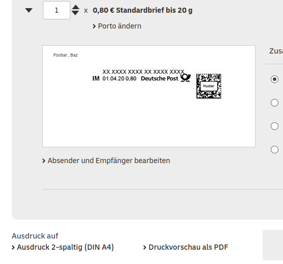

# xetex-briefvorlage-internetmarke

Eine XeTex Briefvorlage, die die Internetmarke der Deutschen Post - 
https://shop.deutschepost.de - im Adressfeld einbindet.

## Dateien

### brief.tex

Die Briefvorlage kompilierbar mit XeTex.

### letter_options.lco

Die Letter Options (Absenderdaten usw.) die im Brief verwendet werden.

### din5008frame.tex

Rahmen und Hilfslinien nach Din 5008 von https://github.com/Stefanqn/Bewerbung.  Die Datei kann im Brief eingebunden 
werden, um das Layout zu überprüfen.

### internetmarke.pdf

Das PDF mit der Internetmarke. Muss auf https://shop.deutschepost.de mit beliebigen Absenderdaten (mindestens zwei Zeilen) generiert werden. 
Die Adressen werden abgeschnitten. Bei der Option `Ausdruck auf` muss `Ausdruck 2-spaltig (DIN A4)` gewählt sein. 

So sollte es dann aussehen: 

Mit der Funktion `Druckvorschau als PDF` kann das Layout getestet werden, ohne dass eine Marke gekauft werden muss.

